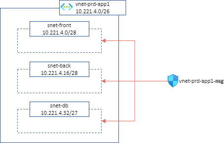
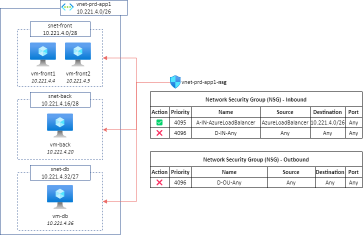
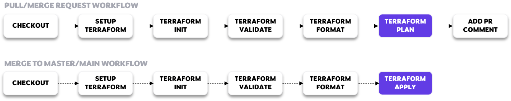

# NSGaC - Network Security Groups as Code
NSGaC is a project that allows to **manage Network Security Groups (NSGs) rules** for VNets in Azure, **as code**. 

NSGaC permits:
* **Auditability**: know who created a rule, when and why
* **Reduce implementation lead time**: once a rule has been requested (via pull request), if all the validations (terraform syntax, manual/automatic approval) are successful, the rule automatically goes into production. The rollback is also part of the CI/CD if needed.
* **Maintain consistent rules**: anything manually created in the portal is deleted. The only source of truth are the nsg rules in this repository.
* **Integration with ITSM systems**: CI/CD is extensible to fit organizations ITIL processes.
* **Enforce micro segmentation easily**: create isolation and determine if two endpoints should access each other by managing rules correctly.

Table of content:
- [NSGaC - Network Security Groups as Code](#nsgac---network-security-groups-as-code)
  - [Deployment model](#deployment-model)
    - [Filtering considerations](#filtering-considerations)
  - [Security rules organization](#security-rules-organization)
  - [Project organization](#project-organization)
  - [Terraform tfstate management](#terraform-tfstate-management)
- [CI/CD](#cicd)
  - [Repository configuration](#repository-configuration)
  - [Protect `main` branch](#protect-main-branch)
  - [CI/CD workflows](#cicd-workflows)
- [FAQ](#faq)
  - [How this project should be used ?](#how-this-project-should-be-used-)
  - [How to request FW rule in a NSG ?](#how-to-request-fw-rule-in-a-nsg-)
  - [How to onboard a VNet with NSGaC ?](#how-to-onboard-a-vnet-with-nsgac-)
  - [What are possible values for `src`, `dst`, `protocol` and `port` fields in a security rule  ?](#what-are-possible-values-for-src-dst-protocol-and-port-fields-in-a-security-rule--)
  - [How to enforce NSG Flow logs with NSGaC ?](#how-to-enforce-nsg-flow-logs-with-nsgac-)
- [Aknowledgment](#aknowledgment)


## Deployment model 

**Central principle**: `1 VNet = 1 Network Security Group (NSG)`.
  * The NSG will be **associated to all subnets of the VNet**:

 

> Using this deployment model, unless you have a specific reason, NSGs association to network interfaces is useless because all the trafic is already filtered by VNet's NSG.

### Filtering considerations

[Default security rules](https://learn.microsoft.com/en-us/azure/virtual-network/network-security-groups-overview#default-security-rules) in NSGs are too permissives.

A good practice is to override them with below 4095 & 4096 rules:



These rules imply that **each network flow must be explicitly authorized**, even when VMs are part of the same subnet or VNet.

**Special cases**:
* ([same subnet](https://learn.microsoft.com/en-us/azure/virtual-network/network-security-group-how-it-works#intra-subnet-traffic)) If `vm-front1` needs to communicate with `vm-front2`, 2 rules are required:
  * Outbound: Allow src `vm-front1` to dst `vm-front2`
  * Inbound: Allow src `vm-front1` to dst `vm-front2`
* (same VNet) If `vm-back` needs to communicate with `vm-db`, 2 rules are required:
  * Outbound: Allow src `vm-back` to dst `vm-db`
  * Inbound: Allow src `vm-back` to dst `vm-db`

## Security rules organization

NSG contains Inbound and Outbound security rules. Each organization has its own way of organizing its security rules.

As part of the NSGaC project, the below model is proposed:

| **Priority** 	| **Purpose** 	|                                                                                                      **Examples**                                                                                                      	|                   **Rules location in NSGaC**                  	|
|:---------:	|:-----------------:	|:----------------------------------------------------------------------------------------------------------------------------------------------------------------------------------------------------------------------:	|:-----------------------------------------------------:	|
| 100-199   	| Reserved          	| Manual troubleshooting from AzurePortal                                                                                                                                                                                	| N/A, manually through Azure Portal                    	|
| 200-399   	| Default Rules     	| Inbound: Allow on-premise<br>Outbound: Allow all machines in the VNet to communicate with the DNS infrastructure<br>Outbound: Allow the src (vnet address space) to communicate with the Monitoring infrastructure     	| default_inbound_rules.tf<br>default_outbound_rules.tf 	|
| 400-3499  	| Business Rules    	| Inbound: Allow `10.0.0.0/8` to communicate with `vm-front1` and `vm-front2`<br>Outbound: Allow `vm-back` to communicate with `vm-db`<br>Outbound: Allow `vm-back` to communicate with `Storage.WestEurope` Service Tag 	| vnet-prd-app1.tf                                      	|
| 3500-3899 	| Derogation Rules  	| Outbound: Allow `vm-back` to communicate with `Internet` Service Tag directly                                                                                                                                          	| vnet-prd-app1.tf                                      	|
| 3900-4096 	| Default Rules     	| 4095 Inbound: Allow AzureLoadBalancer to communicate with all machines in the VNet<br>4096 Inbound: Deny all<br>4096 Outbound: Deny all                                                                                	| default_inbound_rules.tf<br>default_outbound_rules.tf 	|

The idea of having a dedicated range for derogations allows and makes easy the review of these rules by the security teams.

## Project organization

This project is organized as following:
* `azure-nsgac/`: Terraform module
* `providers.tf`:
  * TODO: déclarer le tfstate dans Azure
  * TODO: faire marcher dans plusieurs souscriptions en utilisant les alias
* `ipgroups.tf`: List of IP Groups (applications, usual ranges (RFC1918)) that can be used in security rules.
```terraform
variable "rfc_1918_cidrs" {
  type    = list(any)
  default = ["10.0.0.0/8", "176.16.0.0/12", "192.168.0.0/16"]
}

# App1 - Prod- VM Front 1 IP
variable "app1_vm_front1_ips" {
  type    = list(any)
  default = ["10.221.4.4"]
}
```
* `default_inbound_rules.tf`: List of Inbound rules to insert in all NSGs.  Preferred priority ranges: `200-399` and `3900-4096`.
```terraform
variable "default_inbound_rules" {
  type        = list(any)
  description = "List of default inbound rules to insert in all NSGs."
  default = [
    {
      priority = 4095
      name     = "A-IN-AzureLoadBalancer"
      src      = ["AzureLoadBalancer"]
      dst      = ["vnet_address_space"]
      protocol = "*"
      port     = ["*"]
      access   = "Allow"
      desc     = "Default rule - Allow Azure Load Balancer"
    },
    {
      priority = 4096
      name     = "D-IN-ALL"
      src      = ["*"]
      dst      = ["*"]
      protocol = "*"
      port     = ["*"]
      access   = "Deny"
      desc     = "Default Rule - Deny all."
    }
  ]
}
```
* `default_outbound_rules.tf`: List of Outbound rules to insert in all NSGs. Preferred priority ranges: `200-399` and `3900-4096`.
* `vnet-prd-app1.tf`:
  * Describes the VNet to onboard as part of NSGaC. Specify VNet name, resource group, (optional) subnets to exclude, (optional) default rules to include
  * Contains Inbound and Outbound security rules. Preferred priority ranges: `400-3499` for business rules and `3500-3899` for derogation rules.
```terraform
module "vnet-prd-app1" {
  source = "./azure-nsgac"
  providers = {
    azurerm = azurerm.mysubscriptionalias
  }

  # VNet description
  resource_group_name = "prd-app1"
  vnet_name           = "vnet-prd-app1"
  #excluded_subnets_nsg = [""]

  # (Optionnal) Default Rules
  default_outbound_rules = var.default_outbound_rules
  default_inbound_rules  = var.default_inbound_rules

  # INBOUND RULES
  vnet_inbound_rules = [
    {
      priority = 1000
      name     = "A-IN-ALL-VM_Front2-VM_Front1"
      src      = var.app1_vm_front1_ips
      dst      = var.app1_vm_front2_ips
      protocol = "*"
      port     = ["*"]
      access   = "Allow"
      desc     = ""
    }
  ]
  # OUTBOUND RULES
  vnet_outbound_rules = [
    {
      priority = 1000
      name     = "A-OU-ALL-VM_Front1-VM_Front2"
      src      = var.app1_vm_front1_ips
      dst      = var.app1_vm_front2_ips
      protocol = "*"
      port     = ["*"]
      access   = "Allow"
      desc     = ""
    }
  ]
}
``` 
With this organization, **1 VNet to onboard as part of NSGaC = 1 .tf file**.

## Terraform tfstate management

By default, Terraform state is stored locally which is not ideal because only the CI/CD pipeline will be able to deploy resources in this project.

**This project use Azure Storage as a backend to store `tfstate` file**. Storage Account creation a repository configuration is explained in the next session.

Note that you can update the code to use other backends like [Terraform Cloud](https://developer.hashicorp.com/terraform/tutorials/cloud/cloud-migrate).

# CI/CD

## Repository configuration

CI/CD pipeline part of this project deploy automatically NSGs. The pipeline requires an Azure Service Principal to deploy NSG, security rules and NSG to subnets association.

1. Create a Storage Account and configure terraform to use it as a backend to store `tfstate` file

* [Create the Storage Account](https://learn.microsoft.com/en-us/azure/developer/terraform/store-state-in-azure-storage?tabs=azure-cli#2-configure-remote-state-storage-account): 
```bash
#!/bin/bash

RESOURCE_GROUP_NAME=tfstate
STORAGE_ACCOUNT_NAME=tfstate$RANDOM
CONTAINER_NAME=tfstate

# Create resource group
az group create --name $RESOURCE_GROUP_NAME --location westeurope

# Create storage account
az storage account create --resource-group $RESOURCE_GROUP_NAME --name $STORAGE_ACCOUNT_NAME --sku Standard_LRS --encryption-services blob

# Create blob container
az storage container create --name $CONTAINER_NAME --account-name $STORAGE_ACCOUNT_NAME

echo "Storage Account Name: $STORAGE_ACCOUNT_NAME"
```

* [Configure terraform backend state](https://learn.microsoft.com/en-us/azure/developer/terraform/store-state-in-azure-storage?tabs=azure-cli#3-configure-terraform-backend-state)

Update `providers.tf` with below config and replace `<storage_account_name>`:
```terraform
terraform {
  required_providers {
    azurerm = {
      source  = "hashicorp/azurerm"
      version = "=3.38.0"
    }
  }
    backend "azurerm" {
        resource_group_name  = "tfstate"
        storage_account_name = "<storage_account_name>"
        container_name       = "tfstate"
        key                  = "terraform.tfstate"
    }

}
```

2. Create the Azure Service Principal

`az ad app create --display-name "AZ_AD_SP_NSGaC"  --skip-assignment` 

Result:

```bash
{
  "appId": "xxxxxxxx-xxxx-xxxx-xxxx-xxxxxxxxxxxx",
  "displayName": "AZ_SP_NSGaC",
  "password": "xxxxxxxxxxxxxxxxxxxxxxxxxxxxxxxxxxxxxxxx",
  "tenant": "xxxxxxxx-xxxx-xxxx-xxxx-xxxxxxxxxxxx"
}
```
3. Assign built-in `Network Contibutor` role to "AZ_SP_NSGaC" on all required subscriptions

> If you want to use a more precise scope, you must assign the "Network Contributor" right to all the resource groups containing the VNets that the NSGaC project must manage.

4. Assign built-in `Storage Account Contributor` role to "AZ_SP_NSGaC" on previously created Storage Account.

5. Configure repository secrets used by the CI/CD pipeline

Declare below variables as part of repository secrets:
* `ARM_CLIENT_ID` ; value: `appId` above
* `ARM_CLIENT_SECRET` ; value: `password` above
* `ARM_SUBSCRIPTION_ID` ; value: subscription id of storage account
* `ARM_TENANT_ID` ; value: `tenant` above

[Documentation to declare these variables](https://github.com/Azure/actions-workflow-samples/blob/master/assets/create-secrets-for-GitHub-workflows.md#creating-secrets).

## Protect `main` branch

The repository **must be configured to prevent pushing to `main` branch**. Only Pull/Merge Requests must be accepted.

[Documentation to configure this restriction](https://stackoverflow.com/questions/46146491/prevent-pushing-to-master-on-github).

## CI/CD workflows

Below workflow is used in this project:


**Important**: The *MERGE TO MASTER/MAIN WORKFLOW* is also **scheduled to run at 12.am daily**.
* Goal: Remove potential manual rules created through the portal.

The workflow can be extended to add custom steps like manual approval, rules priority checks, ...

The CI/CD of this project is **powered by GitHub Actions**. The pipeline is store in `.github/workflows/terraform.yml` file.


# FAQ

## How this project should be used ?

This project should be used by an organization wanting to manage all of its NSG security rules centrally for all (or a set) of its VNets in Azure.

## How to request FW rule in a NSG ?

Follow below process:
1. Clone current repository
2. Create a branch named "rules-SOMETHING"
3. Create / Update security rules
4. Push the new branch
5. Create a Pull/Merge Request

## How to onboard a VNet with NSGaC ?

1. **Prerequisites**:
   1. Check that there is no NSG named {vnet_name}-nsg in the VNet resource group
   2. Verify that no VNet subnets are associated with an NSG
2. Declare VNet subscription alias in `providers.tf` if the subscription is not already declared:

Replace `SUBSCRIPTION_NAME` and `SUBSCRIPTION_ID` below:
```terraform
provider "azurerm" {
  alias           = "SUBSCRIPTION_NAME"
  subscription_id = "SUBSCRIPTION_ID"

  features {}
}
```
> If you want to manage several VNets of the same subscription in NSGaC, it is not necessary to declare above block multiple times.

3. Create a `vnet-{vnet_name}.tf` file based on following syntax, and create desired security rules:

Replace `TO_COMPLETE` and `SUBSCRIPTION_NAME` below:
```terraform
module "TO_COMPLETE" {
  source = "./azure-nsgac"
  providers = {
    azurerm = azurerm.SUBSCRIPTION_NAME
  }

  # Vnet description
  resource_group_name = "TO_COMPLETE"
  vnet_name           = "TO_COMPLETE"
  #excluded_subnets_nsg = [""]

  # (Optionnal) Default Rules
  default_inbound_rules  = var.default_inbound_rules
  default_outbound_rules = var.default_outbound_rules

  # INBOUND RULES
  vnet_inbound_rules = [
  ]

  # OUTBOUND RULES
  vnet_outbound_rules = [
  ]
}
```

Optional parameters: `excluded_subnets_nsg`, `default_inbound_rules` and `default_outbound_rules`.

## What are possible values for `src`, `dst`, `protocol` and `port` fields in a security rule  ?

* src and dst
  * Single IP address: ```src = ["1.2.3.4"]```
  * Multiple IP addresses: ```src = ["1.2.3.4", "1.2.3.5"]```
  * Variable: ```src = var.rfc_1918_cidrs```
    > `var.rfc_1918_cidrs` must be of type list()
  * IP addresses and variables: ```src = ["1.2.3.4", var.app1_vm_back_ips]```
  * Service Tag: ```src = ["Internet"]```
    > **Attention**: This is not possible to use multiple Service Tags with comma separated syntax in the same security rule
    > 
    > 1 Service Tag required  = 1 security rule
  * VNet adress space: ```src = ["vnet_address_space"]```
    > Keyword `vnet_address_space` will be replaced during execution by address space(s) of VNet to which the NSG created will be attached
* protocol
  * possible values: `["Tcp"]`, `["Udp"]`, `["Icmp"]`, `["Ah"]`, `["Esp"]` or `["*"]` 
* port
  * Single port: ```port = ["53"]```
  * Multiple ports: ```port = ["80", "443"]```
  * Port range: ```port = ["8080-8090"]```
  * All ports: ```port = ["*"]```

## How to enforce NSG Flow logs with NSGaC ?

NSG Flow logs is not supported by NSGaC. We recommend to leverage [Azure Policy](https://learn.microsoft.com/en-us/azure/network-watcher/nsg-flow-logs-policy-portal) to deploy automatically NSG Flow Logs on all NSGs.

# Aknowledgment

Thanks to the following people for their contribution:
* [Vincent Misson](https://github.com/vmisson)
